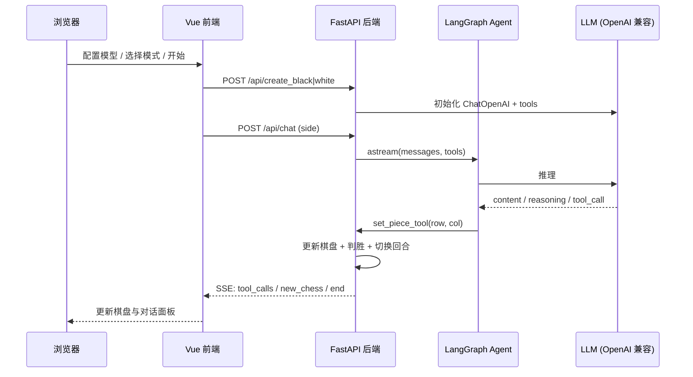
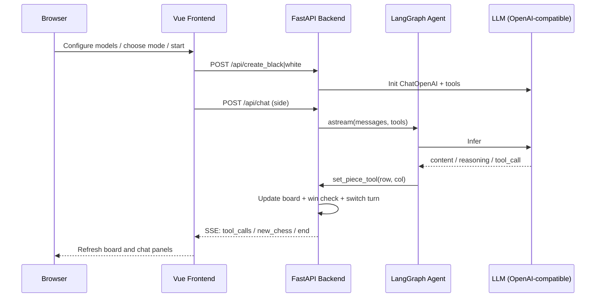

# Gobang with LLM / 大模型对弈五子棋

> 让两个（或一个人类 + 一个）大模型 Agent 在棋盘上「自己下」五子棋，前端实时展示思考过程、工具调用与落子。
>
> A Gomoku (Five-in-a-Row) playground where LLM agents play against each other — or against a human — with live reasoning, tool calls, and board updates streamed to the browser.

[中文](#中文) | [English](#english)

---

## 中文

### 项目简介

`Gobang with LLM` 是一个基于 **FastAPI + LangGraph Agent + Vue 3** 的练习项目：把「下棋」变成 Agent 的工具调用，两侧大模型各自持黑/白子，通过读盘、落子工具完成一整局五子棋。

- **黑棋 Agent** / **白棋 Agent** 可独立配置不同的 `base_url`、`api_key`、`model`
- 支持 **AI 对 AI**、**人类执黑**、**人类执白** 三种对局模式
- 通过 **SSE 流式** 推送模型思考（`reasoning_content`）、正文回复、工具名与最新棋盘
- 13×13 棋盘，五子连珠判胜，回合自动切换

### 功能特性

| 特性 | 说明 |
|------|------|
| 双 Agent 独立配置 | 黑白双方可接入不同 OpenAI 兼容模型 |
| 三种对局模式 | 双方都是大模型 / 人类执黑先手 / 人类执白后手 |
| 实时流式对话 | SSE 推送思考、回复、工具调用 |
| 工具调用下棋 | Agent 使用 `get_chess_board`、`set_piece_tool` 完成落子 |
| 胜负判定 | 最新落子处八向检测，连成五子即结束 |
| 会话记忆 | LangGraph `InMemorySaver` 按 `chat_id_side` 保留上下文 |
| 配置持久化 | 浏览器 `localStorage` 保存模型配置，刷新后可自动初始化 |

### 技术栈

| 层级 | 技术 |
|------|------|
| 后端 | Python · FastAPI · Uvicorn · LangChain · LangGraph · LangChain-OpenAI · Pydantic |
| 前端 | Vue 3 · Vite · Axios · `@microsoft/fetch-event-source` |
| 协议 | REST + SSE（`text/event-stream`） |
| 模型接入 | 任意 OpenAI 兼容的 Chat Completions 接口 |

### 项目结构

```
GobangWithLLM/
├── backend/
│   ├── main.py              # FastAPI 服务：棋盘状态、Agent 工具、SSE 流式输出
│   └── requirements.txt     # 后端 Python 依赖
└── frontend/
    ├── index.html
    ├── vite.config.js       # /api 代理到 localhost:8000
    ├── package.json
    └── src/
        ├── main.js
        ├── App.vue
        ├── style.css
        └── components/
            └── ChessBoard.vue   # 棋盘 UI、模型配置、对局控制与 SSE 消费
```

### 快速开始

#### 环境要求

- Python 3.10+（建议）
- Node.js 18+ 与 npm
- 一个 OpenAI 兼容的模型服务（官方 API、DeepSeek、通义、本地 vLLM / Ollama 代理等均可）

#### 1. 启动后端

```bash
cd backend

# 安装依赖
pip install -r requirements.txt

# 启动服务（默认 http://127.0.0.1:8000）
python main.py
```

> 也可用：`uvicorn main:app --host 0.0.0.0 --port 8000`

#### 2. 启动前端

```bash
cd frontend
npm install
npm run dev
```

浏览器打开终端提示的地址（一般是 `http://localhost:5173`）。Vite 已将 `/api` 代理到后端 `http://localhost:8000`。

#### 3. 配置模型并开局

1. 点击左侧 **黑棋设置**，填写 `base_url` / `api_key` / `model`，点确定  
2. 点击右侧 **白棋设置**，同样完成配置  
3. 两侧都加载完成后，选择对局模式，点 **开始**

示例配置（以任意 OpenAI 兼容服务为准）：

| 字段 | 示例 |
|------|------|
| base_url | `https://api.openai.com/v1` |
| api_key | `sk-...` |
| model | `gpt-4o-mini` / `deepseek-chat` / 其他兼容模型名 |

### 对局模式

| 模式 | `mode` | 说明 |
|------|--------|------|
| 双方都为大模型 | `0` | 两侧 Agent 自动轮流落子，可旁观全程 |
| 执黑棋（先手） | `1` | 人类先落黑子，再由白棋 Agent 应对 |
| 执白棋（后手） | `2` | 黑棋 Agent 先落子，人类随后落白子 |

### 后端 API

| 方法 | 路径 | 说明 |
|------|------|------|
| `POST` | `/api/create_black` | 初始化黑棋 Agent（body: `base_url`, `api_key`, `model`） |
| `POST` | `/api/create_white` | 初始化白棋 Agent（同上） |
| `GET` | `/api/chess` | 获取当前 13×13 棋盘（`0` 空 / `1` 黑 / `2` 白） |
| `POST` | `/api/set_chess` | 人类落子（body: `side`, `row`, `col`） |
| `POST` | `/api/chat` | 触发指定一方 Agent 回合，返回 SSE 流 |

#### SSE 事件类型

| event | data | 含义 |
|-------|------|------|
| `reasoning_content` | 文本片段 | 模型思考过程（若底层模型提供） |
| `content` | 文本片段 | 模型正文回复 |
| `tool_calls` | 工具名 | Agent 调用的工具（如 `set_piece_tool`） |
| `new_chess` | JSON 棋盘 | 本回合未结束，返回最新盘面 |
| `end` | JSON 棋盘 | 对局结束，返回终局盘面 |

### 工作原理



核心设计：

1. **棋盘是全局状态**：后端进程内存中维护 `chess[row][col]` 与 `turn`  
2. **下棋是工具**：`set_piece_tool` 校验回合与空位后落子，返回 `new_chess` 或 `end`  
3. **Agent 带记忆**：`InMemorySaver` 按 `thread_id = chat_id_side` 保留对话历史  
4. **前端只消费 SSE**：按事件类型更新消息气泡或整盘数据，人类回合则走 `/api/set_chess`

### 注意事项

- 棋盘、回合均为**进程内全局变量**，后端重启会清空对局  
- 配置写在浏览器 `localStorage`，**不要在公共电脑上填写生产 API Key**  
- CORS 已放开为 `*`，仅适合本地练习场景  
- 若模型不支持 `reasoning_content`，思考区可能始终为空，属正常现象  
- 后端依赖见 `backend/requirements.txt`，安装：`pip install -r requirements.txt`

### License

本仓库为学习练习项目，未附带开源许可证。使用前请自行确认模型服务条款。

---

## English

### Overview

`Gobang with LLM` is a practice project built with **FastAPI + LangGraph agents + Vue 3**. It turns Gomoku (Five-in-a-Row) into agent tool-calling: two LLM agents (or one human + one LLM) take turns reading the board and placing stones.

- Independent config per side (`base_url`, `api_key`, `model`) for black and white
- Three modes: **AI vs AI**, **human plays black (first)**, **human plays white (second)**
- **SSE streaming** of model reasoning, content, tool names, and board updates
- 13×13 board, five-in-a-row win detection, automatic turn switching

### Features

| Feature | Description |
|---------|-------------|
| Dual-agent config | Black and white can use different OpenAI-compatible models |
| Three game modes | AI vs AI / human as black / human as white |
| Live streaming chat | SSE delivers reasoning, replies, and tool calls |
| Tool-based moves | Agents call `get_chess_board` and `set_piece_tool` |
| Win check | 8-direction scan from the last stone; 5 in a row ends the game |
| Conversation memory | LangGraph `InMemorySaver` keyed by `chat_id_side` |
| Config persistence | Model settings saved in `localStorage` and auto-restored |

### Tech Stack

| Layer | Stack |
|-------|-------|
| Backend | Python · FastAPI · Uvicorn · LangChain · LangGraph · LangChain-OpenAI · Pydantic |
| Frontend | Vue 3 · Vite · Axios · `@microsoft/fetch-event-source` |
| Protocol | REST + SSE (`text/event-stream`) |
| Models | Any OpenAI-compatible Chat Completions endpoint |

### Project Structure

```
GobangWithLLM/
├── backend/
│   ├── main.py              # FastAPI: board state, agent tools, SSE streaming
│   └── requirements.txt     # Backend Python dependencies
└── frontend/
    ├── index.html
    ├── vite.config.js       # Proxies /api to localhost:8000
    ├── package.json
    └── src/
        ├── main.js
        ├── App.vue
        ├── style.css
        └── components/
            └── ChessBoard.vue   # Board UI, model config, game control, SSE consumer
```

### Quick Start

#### Prerequisites

- Python 3.10+ (recommended)
- Node.js 18+ and npm
- An OpenAI-compatible model endpoint (OpenAI, DeepSeek, local vLLM / Ollama proxy, etc.)

#### 1. Start the backend

```bash
cd backend

# Install dependencies
pip install -r requirements.txt

# Run the server (default http://127.0.0.1:8000)
python main.py
```

> Alternative: `uvicorn main:app --host 0.0.0.0 --port 8000`

#### 2. Start the frontend

```bash
cd frontend
npm install
npm run dev
```

Open the URL printed by Vite (usually `http://localhost:5173`). The dev server proxies `/api` to `http://localhost:8000`.

#### 3. Configure models and play

1. Click **黑棋设置** (Black settings) on the left; fill `base_url` / `api_key` / `model`; confirm  
2. Click **白棋设置** (White settings) on the right and do the same  
3. After both sides initialize, pick a mode and click **开始** (Start)

Example config for any OpenAI-compatible service:

| Field | Example |
|-------|---------|
| base_url | `https://api.openai.com/v1` |
| api_key | `sk-...` |
| model | `gpt-4o-mini` / `deepseek-chat` / other compatible model name |

### Game Modes

| Mode | `mode` | Description |
|------|--------|-------------|
| Both AI | `0` | Both agents play automatically; you can watch |
| Human black (first) | `1` | You place black stones first; white agent replies |
| Human white (second) | `2` | Black agent opens; you place white stones |

### Backend API

| Method | Path | Description |
|--------|------|-------------|
| `POST` | `/api/create_black` | Init black agent (body: `base_url`, `api_key`, `model`) |
| `POST` | `/api/create_white` | Init white agent (same body) |
| `GET` | `/api/chess` | Current 13×13 board (`0` empty / `1` black / `2` white) |
| `POST` | `/api/set_chess` | Human move (body: `side`, `row`, `col`) |
| `POST` | `/api/chat` | Trigger one agent's turn; returns an SSE stream |

#### SSE event types

| event | data | Meaning |
|-------|------|---------|
| `reasoning_content` | text chunk | Model reasoning (if the backend model provides it) |
| `content` | text chunk | Model reply text |
| `tool_calls` | tool name | Tool the agent invoked (e.g. `set_piece_tool`) |
| `new_chess` | JSON board | Game continues; latest board |
| `end` | JSON board | Game finished; final board |

### How It Works



Design notes:

1. **Board is in-process state** — `chess` and `turn` live in backend memory  
2. **Moves are tools** — `set_piece_tool` validates turn/emptiness, then returns `new_chess` or `end`  
3. **Agents have memory** — `InMemorySaver` uses `thread_id = chat_id_side`  
4. **Frontend only consumes SSE** — human turns go through `/api/set_chess`

### Caveats

- Board and turn are **global process state**; restarting the backend clears the game  
- Configs are stored in browser `localStorage` — **do not paste production API keys on shared machines**  
- CORS is open (`*`) for local practice only  
- If the model does not emit `reasoning_content`, the reasoning panel may stay empty — that is expected  
- Backend dependencies are listed in `backend/requirements.txt`; install with `pip install -r requirements.txt`

### License

This repository is a learning project and ships without an explicit open-source license. Please check your model provider's terms before use.
